## Назначение документа

Этот документ описывает трансформацию текущей системы RetailCore в целевую архитектуру ближайшего этапа. Целевое состояние является промежуточным: критичный контур оформления заказа сохраняется в монолите, а первыми изменяются участки, которые позволяют снизить связанность и повысить прозрачность без полной переработки системы.

---

## 1. Бизнес-цель

### Формулировка цели

> Повысить устойчивость и прозрачность базового order flow и создать более безопасный контур для дальнейших коммерческих изменений без остановки бизнеса и полной замены монолитного ядра.

### Контекст цели

| Параметр | Описание |
|----|----|
| Текущая проблема | Изменения платформы стали дорогими, рискованными и непредсказуемыми. Статусы и данные заказа неоднородны, интеграции сильно связаны с монолитом и Oracle |
| Кого затрагивает | Клиенты, поддержка, цифровые продажи, ИТ-команды, аналитика, логистика и партнёры |
| Желаемое изменение | Изолировать менее рискованные участки: состояние заказа, интеграционный обмен и аналитическое чтение. Сохранить критичный order flow в существующем контуре |
| Горизонт изменений | Первый управляемый этап трансформации |
| Ожидаемый эффект | Снижение ручных разборов и расхождений данных, уменьшение новых зависимостей от Oracle, подготовка основы для дальнейшей декомпозиции |

### Проверочный вопрос

> Если трансформацию не сделать, платформа сохранит высокую связанность и непредсказуемость изменений, что ограничивает скорость развития коммерческих сценариев и устойчивость order flow

---

## 2. Уточнённые требования

| Исходная формулировка | Что показали интервью и анализ AS-IS | Уточнённое требование для ближайшего этапа | Обоснование |
|----|----|----|----|
| Ускорить развитие платформы и вывод новых сценариев | Полная замена checkout слишком рискованна. Монолит остаётся центральным оркестратором | Развивать новый контур рядом с монолитом, не перенося оформление заказа на первом этапе | Бизнес требует поэтапных изменений с контролируемым риском |
| Обеспечить прозрачное состояние заказа | Статусы меняются в нескольких компонентах, batch-процессах и административных сценариях | Ввести канонический поток событий заказа и отдельную модель состояния и истории | Поддержке и другим потребителям нужна целостная картина заказа |
| Стабилизировать логистические интеграции | Используется смесь REST, очередей, shared tables и batch; retry и идемпотентность неоднородны | Ввести единый интеграционный слой/ACL для постепенно мигрируемых интеграций | Можно снизить связанность, не вынося сразу весь Delivery Routing |
| Повысить качество аналитических данных | Аналитика зависит от Oracle, API, staging и CSV. Отсутствует единая модель заказа | Переводить новые и мигрируемые аналитические consumers на канонические события и отдельное хранилище | Снижается операционная зависимость аналитики от Oracle |

### Минимальная проверка

- новый контур не заменяет критичный order flow
- изменения ограничены состояниями, интеграциями и аналитическим чтением
- legacy-пути сохраняются на переходный период
- результат должен быть наблюдаем и сопоставим с текущим контуром

---

## 3. Ограничения

| Ограничение | Тип ограничения | Как влияет на решение | Можно ли изменить в ближайшем этапе |
|----|----|----|----|
| Нельзя останавливать бизнес для большой миграции | Организационное / бизнес | Требуется поэтапная миграция и сосуществование AS-IS и TO-BE | Нет |
| Создание и обработка заказа имеют высокую связанность | Технологическое | Нельзя безопасно вынести создание заказа первым шагом | Нет |
| Оплата относится к критичному order flow | Бизнес / технологическое | Payment Orchestration остаётся в монолите | Нет |
| Delivery Routing содержит распределённые правила и исключения | Технологическое / процессное | Сначала изменяется интеграционный слой, а не сама маршрутизация | Частично |
| Oracle содержит операционные данные, процедуры и скрытые зависимости | Данные / технологическое | Нельзя одномоментно отказаться от Oracle или разделить все данные | Частично |
| Численные SLA/SLO и допустимые задержки нового контура не определены | Требования | Нельзя зафиксировать количественные критерии переключения без дополнительного согласования | Да |

### Проверочный вопрос

> Технически привлекательные варианты полной переписи checkout, немедленного выделения всех сервисов и отказа от Oracle не подходят для ближайшего этапа из-за риска для базового order flow и скрытых зависимостей.

---

## 4. Препятствия текущего состояния

| Препятствие | Где проявляется | Влияние на бизнес-цель | Причина в текущей архитектуре или процессе | Доказательство / источник |
|----|----|----|----|----|
| Нет единой модели состояния заказа | Order Processing, Status Management, payment, batch, support | Поддержка и бизнес не получают целостную картину заказа | Переходы статусов распределены между несколькими компонентами и ручными сценариями | Интервью техлида монолита и руководителя поддержки |
| Неоднородные интеграции | Логистика и партнёрские системы | Повышаются риск дублей, ручных разборов и стоимость изменений | REST, очереди, shared tables, polling и batch используются одновременно | Интервью разработчика интеграций |
| Аналитика зависит от операционной Oracle | Аналитика и отчётность | Аналитическая нагрузка влияет на операционный контур; показатели расходятся | SQL, staging, API, CSV и разные интерпретации бизнес-объектов | Интервью разработчика аналитики |
| Высокая связанность checkout | Java-монолит и Oracle | Даже локальные изменения могут затрагивать несколько участков | Pricing, promo, delivery, payment, statuses и Oracle объединены в order flow | Интервью техлида и фрагмент OrderProcessingService |
| Существенная логика находится в Oracle | Данные и бизнес-правила | Усложняет выделение компонентов и отказ от общей БД | Процедуры, правила, staging и служебные таблицы используются разными компонентами | Интервью техлида и разработчика интеграций |

### Рекомендация

> Высокая связанность критичного order flow → локальные изменения имеют непредсказуемые последствия → полная декомпозиция первого этапа создаёт недопустимый риск для бизнес-цели.

---

## 5. Точки трансформации

| Точка трансформации | Какое препятствие закрывает | Что меняем | Почему это можно сделать сейчас | Ожидаемый эффект | Метрика проверки |
|----|----|----|----|----|----|
| Канонические события заказа и Order State Read Model | Нет единой модели состояния заказа | Вводим единый контракт событий и отдельную модель чтения состояния и истории | Чтение статусов меньше связано с критичной транзакцией оформления | Повышение прослеживаемости и снижение расхождений состояния | Количество расхождений состояний; время восстановления истории заказа |
| Integration Layer / ACL | Неоднородные логистические и партнёрские интеграции | Постепенно переводим интеграции на единый защитный слой и контракт статусов | Можно менять интеграционный обмен без переноса всей Delivery Routing | Снижение дублей, ошибок retry и ручных разборов | Количество дублей, ошибок повторной обработки и ручных исправлений |
| Аналитическое чтение вне Oracle | Зависимость аналитики от операционной Oracle | Новые и мигрируемые consumers получают данные через события и отдельное Analytics Store | Аналитика находится вне критичной транзакции checkout | Снижение нагрузки на Oracle и повышение согласованности данных | Доля прямых аналитических запросов к Oracle; расхождения витрин; freshness |

### Проверка качества точки трансформации

1. Все три точки связаны с устойчивостью, прозрачностью или скоростью дальнейших изменений.
2. Они не требуют немедленной замены критичного order flow.
3. Для каждой определены наблюдаемые метрики; численные целевые значения требуют отдельного согласования.

---

## 6. Не точки трансформации

| Элемент | Почему важен | Почему не входит в ближайший этап | Как учитывать дальше |
|----|----|----|----|
| Core Order Create / полная замена checkout | Центральный бизнес-сценарий | Слишком высокая связанность и риск для конверсии и оформления заказов | Будущий этап после стабилизации границ и зависимостей |
| Payment Orchestration | Критична для оплаты и подтверждения заказа | Ошибки напрямую затрагивают деньги и базовый order flow | Сохранять в монолите; рассматривать отдельно позже |
| Полный перенос Delivery Routing | Влияет на обещание доставки | Правила распределены между монолитом, Oracle, конфигурацией и ручными исключениями | После стабилизации интеграционного слоя |
| Полное выделение Pricing & Promo | Важно для скорости коммерческих изменений | Логика распределена между Java, Oracle и fallback-механизмами и находится на критичном пути checkout | Отдельная последующая точка трансформации |
| Полный отказ от Oracle | Снизил бы технологическую связанность | Oracle содержит данные, процедуры, staging и скрытых consumers | Долгосрочная программа разделения данных |
| Полная микросервисная декомпозиция | Может улучшить независимость компонентов | Не является реалистичным состоянием ближайшего этапа | Использовать только там, где появятся подтверждённые границы и ценность |

---

## 7. Приоритизация

| Приоритет | Изменение / точка трансформации | Обоснование приоритета | Зависимости | Риск откладывания |
|----:|----|----|----|----|
| 1 | Канонические события заказа и Order State Read Model | Создаёт основу для прозрачности, аналитики и последующего выделения компонентов | Определение событий, источников истины и correlation ID | Сохранятся расхождения состояния и отсутствие единого потока данных |
| 2 | Integration Layer / ACL | Снижает связанность с legacy-интеграциями без изменения маршрутизации | Канонические контракты статусов и событий | Продолжатся дубли, неоднородные retry и ручные разборы |
| 3 | Аналитическое чтение вне Oracle | Использует событийный слой и уменьшает нагрузку на операционную БД | Точка 1 — канонический событийный поток | Аналитика продолжит влиять на Oracle и использовать неоднородные источники |

---

## 8. Целевая архитектура первого этапа

### Краткое описание TO-BE

> Java-монолит и Oracle сохраняются как критичный операционный контур. Core Order Create, Pricing & Promo, Payment Orchestration и основная Delivery Routing не переносятся. Рядом создаётся новый контур канонических событий заказа, Order State Read Model, Integration Layer / ACL и Analytics Store. Интеграции и аналитические потребители переводятся постепенно, а legacy-пути сохраняются на переходный период для безопасного сосуществования и сверки.

### TO-BE диаграмма

```plantuml
@startuml
!theme plain
left to right direction

skinparam packageStyle rectangle
skinparam componentStyle rectangle
skinparam shadowing false
skinparam wrapWidth 180
skinparam maxMessageSize 180

skinparam rectangle {
  BorderColor #555555
  BackgroundColor #FFFFFF
}

skinparam component {
  BorderColor #555555
  BackgroundColor #F8F8F8
}

skinparam database {
  BorderColor #555555
  BackgroundColor #FFF4CC
}

skinparam queue {
  BorderColor #555555
  BackgroundColor #EAF4FF
}

actor "Клиент" as Customer
actor "Оператор\nподдержки" as Support
actor "Бизнес-\nпользователи" as BusinessUsers

cloud "Маркетплейсы" as Marketplaces
cloud "Платёжные\nпровайдеры" as PaymentProviders
cloud "Службы\nдоставки" as DeliveryPartners
cloud "Внутренние\nBI / отчёты" as BI

rectangle "RetailCore TO-BE — первый этап" as RetailCore {

  component "Интернет-магазин\nи мобильные каналы" as Channels

  package "Java-монолит\nсохраняемый критичный контур" as JavaMonolith {

    component "Checkout / Order API" as OrderApi

    component "Order Processing" as Processing

    component "Pricing & Promo Logic" as Pricing

    component "Status Management" as Statuses

    component "Payment Orchestration" as PaymentOrchestration

    component "Delivery Routing" as DeliveryRouting
  }

  database "Oracle\nоперационная БД + legacy бизнес-логика" as Oracle

  package "Новый контур первого этапа" as NewPlatform {

    queue "Order Event Bus\nканонические события заказа\nи доставки" as OrderEvents

    component "Order State Read Model\nтекущее состояние,\nистория и причины отклонений" as OrderReadModel

    database "Order Read Store\nмодель чтения состояния заказа" as OrderReadDb

    component "Integration Layer / ACL\nединый контракт,\nадаптация legacy-интеграций" as IntegrationLayer

    component "Analytics Ingestion\nобработка канонических событий" as AnalyticsIngestion

    database "Analytics Store\nданные для новых витрин" as AnalyticsStore
  }

  package "Вспомогательные сервисы" as AuxServices {

    component ".NET integration service\nlegacy партнёрские интеграции" as DotNet

    component "Python analytics jobs\nаналитические выгрузки" as PyAnalytics
  }

  queue "Async / batch exchange\nlegacy очереди, задания, выгрузки" as AsyncLayer

  component "Admin / Support tools\nручные проверки и корректировки" as AdminTools
}


' --------------------------------------------------
' Сохраняемый критичный order flow
' --------------------------------------------------

Customer --> Channels : оформление заказа,\nпросмотр статуса

Channels --> OrderApi : create/update order\nсинхронный вызов

Marketplaces --> OrderApi : заказы,\nобновления,\nстатусы

OrderApi --> Pricing : расчёт цены,\nскидок,\nпромо

OrderApi --> Processing : создание и обработка заказа

Processing --> PaymentOrchestration : инициировать оплату

Processing --> DeliveryRouting : выбрать доставку

PaymentOrchestration --> PaymentProviders : синхронный вызов\nсоздания платёжной сессии

Pricing --> Oracle : правила,\nкоэффициенты,\nlegacy promo logic

Processing --> Oracle : заказ,\nрезерв,\nслужебные таблицы

Statuses --> Oracle : статусы,\nистория,\nтехнические состояния

PaymentOrchestration --> Oracle : payment_session_id,\nтехнические атрибуты

DeliveryRouting --> Oracle : правила маршрутизации,\nпартнёры,\nretry-состояния


' --------------------------------------------------
' Точка трансформации 1:
' канонические события + read model
' --------------------------------------------------

Processing --> OrderEvents : события жизненного\nцикла заказа

Statuses --> OrderEvents : изменения состояния

OrderEvents --> OrderReadModel : канонические события

OrderReadModel --> OrderReadDb : обновляет\nмодель чтения

AdminTools --> OrderReadModel : состояние,\nистория,\nпричины отклонений

Support --> AdminTools : разбор обращений,\nручные действия


' --------------------------------------------------
' Точка трансформации 2:
' постепенная изоляция интеграций
' --------------------------------------------------

DeliveryRouting --> IntegrationLayer : запросы для\nпереведённых интеграций

IntegrationLayer --> DeliveryPartners : унифицированный\nконтракт / адаптер

IntegrationLayer --> OrderEvents : статусы и события\nпартнёров

AsyncLayer --> IntegrationLayer : legacy async /\nbatch вход

IntegrationLayer --> DotNet : временная поддержка\nlegacy-контрактов


' Legacy путь сохраняется для ещё не мигрированных интеграций

DeliveryRouting ..> DeliveryPartners : legacy интеграции\nвременно

AsyncLayer ..> DotNet : legacy обмен\nвременно

DotNet ..> Oracle : staging/shared tables\nвременно

DotNet ..> DeliveryPartners : legacy партнёрские\nинтеграции


' --------------------------------------------------
' Точка трансформации 3:
' аналитика вне операционной Oracle
' --------------------------------------------------

OrderEvents --> AnalyticsIngestion : события заказа\nи доставки

AnalyticsIngestion --> AnalyticsStore : нормализованные\nаналитические данные

PyAnalytics --> AnalyticsStore : новые и\nмигрированные пайплайны

PyAnalytics --> BI : витрины\nи отчётные данные

BusinessUsers --> BI : управленческие отчёты


' Legacy аналитика сохраняется на переходный период

PyAnalytics ..> Oracle : legacy выборки\nвременно

BI ..> Oracle : legacy отчёты\nвременно


' --------------------------------------------------
' Существующий legacy async
' --------------------------------------------------

Processing --> AsyncLayer : legacy события,\nзадания,\nвыгрузки


' --------------------------------------------------
' Пояснения
' --------------------------------------------------

note right of Processing
НЕ МЕНЯЕТСЯ НА ПЕРВОМ ЭТАПЕ

Core order create остаётся
в Java-монолите.

Не переносим:
- создание заказа
- основной pricing
- payment orchestration
- основную delivery routing

Причина:
высокий риск для order flow.
end note

note bottom of OrderEvents
ТОЧКА ТРАНСФОРМАЦИИ 1

Единый контракт событий
создаёт основу для:
- прослеживаемости
- read model
- аналитики
- дальнейшей декомпозиции

Гарантии доставки и
допустимая задержка — TBD.
end note

note bottom of OrderReadModel
Первый этап — read-only контур.

Операционным источником
записи остаются
монолит и Oracle.
end note

note right of IntegrationLayer
ТОЧКА ТРАНСФОРМАЦИИ 2

Интеграции переводятся
постепенно.

ACL:
- адаптирует legacy-контракты
- переводит статусы
- унифицирует технический обмен

Routing-решения здесь
не принимаются.
end note

note bottom of AnalyticsStore
ТОЧКА ТРАНСФОРМАЦИИ 3

Новые аналитические consumers
не должны создавать новую
зависимость от операционной Oracle.

Старые отчёты мигрируют
постепенно.
end note

note bottom of Oracle
СОХРАНЯЕТСЯ НА ПЕРВОМ ЭТАПЕ

Oracle остаётся:
- операционной БД
- носителем legacy-логики
- источником для ещё
  не мигрированных consumers

Полное разделение данных
в этот этап не входит.
end note

@enduml
```

Код диаграммы plantuml

### Компоненты целевой архитектуры

| Компонент | Роль в TO-BE | Новый / существующий / изменяемый | Ответственность | Важные ограничения |
|----|----|----|----|----|
| Java-монолит | Критичный операционный контур | Существующий / изменяемый минимально | Checkout, order processing, pricing, payment, routing | Не переносить критичный flow первым этапом |
| Oracle | Операционное хранилище и legacy-логика | Существующий | Данные заказа, процедуры, служебные таблицы | Новые зависимости следует ограничивать |
| Order Event Bus | Канонический событийный поток | Новый | Передача событий заказа и доставки | Семантика доставки и допустимый лаг — TBD |
| Order State Read Model | Единое представление состояния | Новый | Текущее состояние, история, причины отклонений | На первом этапе read-only |
| Integration Layer / ACL | Защитный слой интеграций | Новый | Адаптация контрактов и статусов | Не должен становиться владельцем Delivery Routing |
| Analytics Store | Источник для новых аналитических consumers | Новый | Хранение нормализованных аналитических данных | Старые отчёты мигрируют постепенно |
| Legacy integration / batch | Переходный интеграционный путь | Существующий | Обслуживание ещё не мигрированных сценариев | Сохраняется временно |

### Изменение поведения

| Сценарий | Как работает сейчас | Как будет работать после первого этапа | Что должно быть видно пользователю или операционной роли |
|----|----|----|----|
| Просмотр состояния заказа | Состояние приходится восстанавливать из нескольких систем и технических статусов | Read Model агрегирует канонические события и историю | Поддержка видит текущее состояние, историю и причину отклонения |
| Обмен с логистическим партнёром | Разные механизмы REST, очереди, shared DB и batch | Выбранные интеграции проходят через ACL, остальные временно работают по legacy-пути | Операционные команды получают более предсказуемый статус обработки |
| Аналитическая обработка | Часть отчётов напрямую читает Oracle | Новые consumers используют событийный поток и Analytics Store | Бизнес получает данные из постепенно унифицируемого источника |

---

## 9. Разрыв

| Область | AS-IS | TO-BE первого этапа | Что нужно изменить |
|----|----|----|----|
| Процессы | Ручное восстановление картины заказа и разбор исключений | Поддержка использует агрегированную read model | Определить правила представления состояния и причин |
| Данные | Несколько представлений заказа, сильная зависимость от Oracle | Канонические события + отдельные read/analytics модели | Определить event schema, владельцев и правила сверки |
| Интеграции | REST, очереди, shared DB, batch | Постепенный перевод через ACL | Ввести контракты, retry, идемпотентность и правила миграции |
| Состояния | Переходы распределены между несколькими компонентами | Каноническое представление истории состояния | Согласовать бизнес-события и маппинг legacy-статусов |
| Компоненты | Монолит и Oracle являются центральными зависимостями | Монолит сохраняется, рядом появляется новый контур | Создать Event Bus, Read Model, ACL и Analytics Store |
| Наблюдаемость | Сквозная история заказа восстанавливается не всегда | События и новый контур должны иметь сквозную трассировку | Ввести единый ID, метрики обработки и алерты |
| Операционная модель | Исключения часто требуют знаний отдельных специалистов | Новый контур должен показывать причину отклонения | Обновить инструменты и инструкции поддержки |

### Проверочный вопрос

> Для рабочего TO-BE недостаточно создать новые компоненты: необходимо определить канонические события, правила консистентности, маппинг legacy-состояний, наблюдаемость, критерии миграции consumers и условия отката.

---

## 10. Метрики

Численные AS-IS и целевые значения в источниках не определены. Они должны быть зафиксированы до cutover.

| Метрика | Что проверяет | Базовое значение AS-IS | Целевое значение | Источник данных | Период контроля |
|----|----|----:|----:|----|----|
| Расхождения состояния заказа между Oracle и Read Model | Корректность нового представления | TBD | TBD | Сверка Oracle / Read Store | После релиза / регулярно |
| Время восстановления полной истории заказа | Прозрачность для поддержки | TBD | TBD | Support tools / логи | Еженедельно |
| Дубли при партнёрском обмене | Надёжность ACL | TBD | TBD | Логи интеграций | Ежедневно |
| Ручные разборы интеграционных ошибок | Операционный эффект | TBD | TBD | Support / operations | Еженедельно |
| Доля аналитических запросов напрямую к Oracle | Степень развязки аналитики | TBD | TBD | DB monitoring | Еженедельно |
| Расхождения аналитических витрин | Согласованность данных | TBD | TBD | BI / сверка | После миграции consumer |

### Связь метрик с точками трансформации

| Точка трансформации | Метрика | Что будет считаться успехом | Что будет сигналом проблемы |
|----|----|----|----|
| Order Events + Read Model | Расхождения состояния | Значение в пределах согласованного порога | Необъяснимое расхождение с операционным состоянием |
| Integration Layer / ACL | Дубли и ошибки повторной обработки | Снижение относительно AS-IS | Новый контур создаёт дубли или теряет подтверждения |
| Analytics Store | Прямые запросы к Oracle и расхождения витрин | Постепенное снижение зависимости без ухудшения качества данных | Новая витрина не воспроизводит необходимые бизнес-данные |

---

## 11. Риски и открытые вопросы

### Риски

| Риск | Где возникает | Вероятность | Влияние | Меры контроля | Условие остановки / эскалации |
|----|----|----|----|----|----|
| Read Model расходится с Oracle | События / состояния | Средняя | Высокое | Параллельная сверка старого и нового представления | Необъяснимое расхождение состояния заказа |
| Потеря или дублирование событий | Event Bus | Средняя | Высокое | Идентификаторы событий, идемпотентность, мониторинг | Потеря бизнес-события или неконтролируемые дубли |
| ACL создаёт дубли у партнёров | Интеграции | Средняя | Высокое | Идемпотентность и ограниченный rollout | Повторные заявки/операции у партнёра |
| Новая аналитика расходится с legacy | Analytics Store | Средняя | Среднее | Параллельная сверка витрин | Необъяснимое расхождение бизнес-показателей |
| Изменение затрагивает checkout | Монолит | Низкая | Высокое | Feature flags, ограниченный rollout, rollback | Ухудшение базового order flow |

### Открытые вопросы

| Вопрос | Почему важно уточнить | Кто должен ответить | Срок ответа | Что нельзя делать без ответа |
|----|----|----|----|----|
| Какой набор событий является каноническим? | Определяет контракт нового контура | Команда заказов + интеграции + аналитика | До проектирования Event Bus | Реализовывать event schema |
| Какой допустимый lag Read Model? | Определяет консистентность и критерий качества | Бизнес + поддержка + ИТ | До пилота | Переключать внутренних consumers |
| Какие гарантии доставки событий требуются? | Влияет на брокер, retry и идемпотентность | Архитектура + разработка | До реализации | Выбирать окончательную схему обработки |
| Какие интеграции мигрировать первыми? | Определяет риск и объём пилота ACL | Логистика + операции | До rollout | Переключать партнёров |
| Какие AS-IS и целевые значения метрик принять? | Без них нельзя объективно оценить результат | Владельцы бизнеса и систем | До cutover | Принимать решение о завершении этапа |
